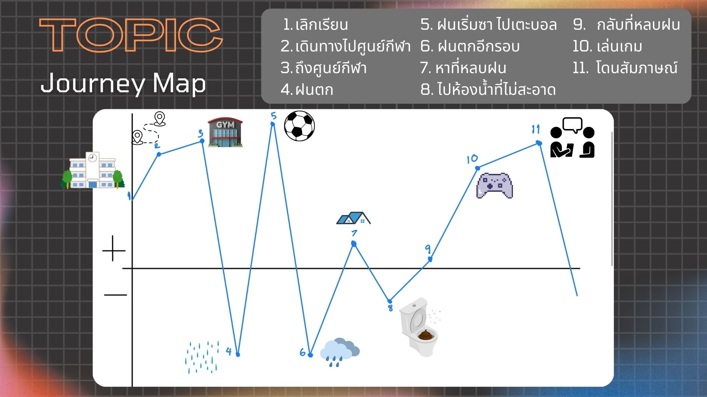
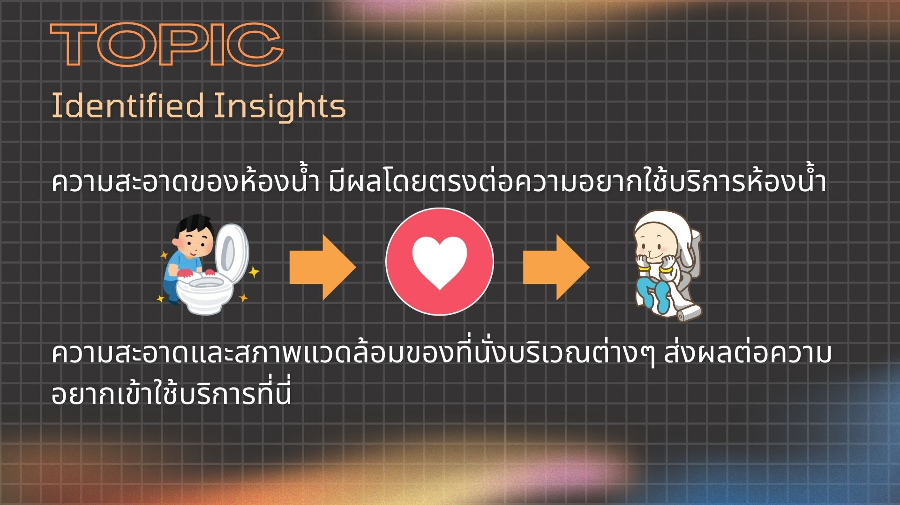
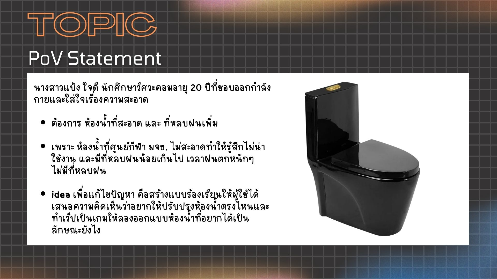
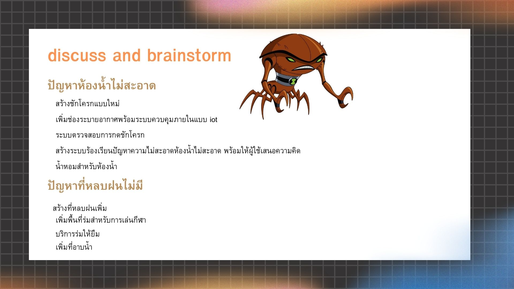
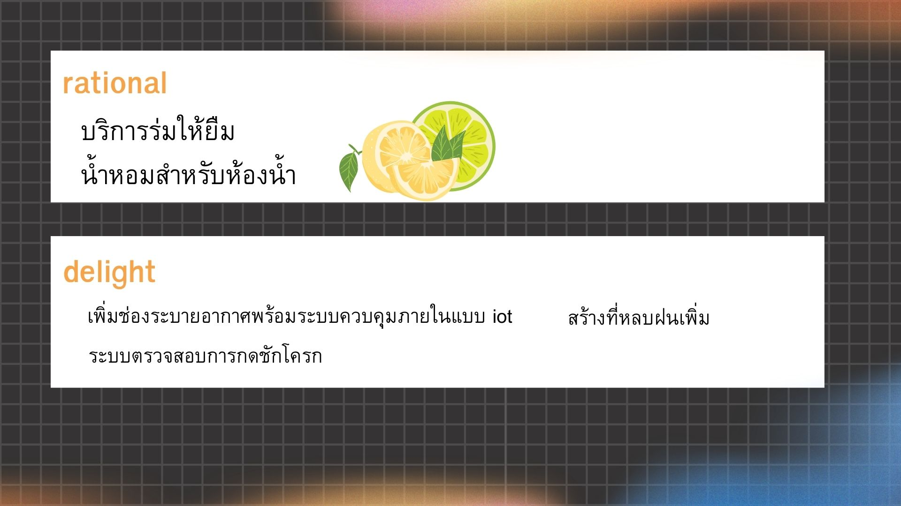
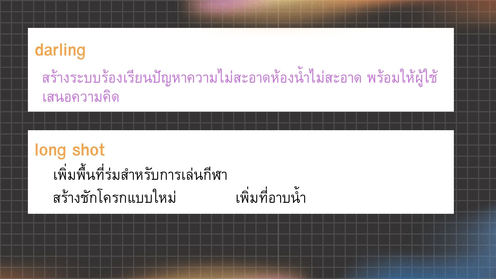
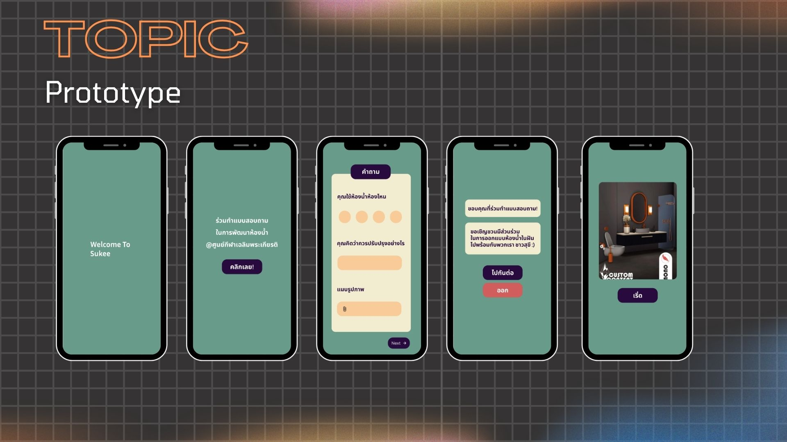

=======
# Script Interview 🚶
สวัสดีครับ ขอบคุณนะครับที่สละเวลามาให้สัมภาษณ์กับพวกเรานะครับ วันนี้อยากะถามประสบการณ์ที่เกี่ยวข้องกับการใช้ศูนย์กีฬา 
เพื่อหาปัญหาและนำไปใช้ในนการพัฒนาแก้ไข ในการสัมภาษณ์พวกเราขออนุญาตอัดเสียง/เพื่อใช้เป็นข้อมูลใช้ในการสรุป 

ก่อนเริ่มอยากให้เล่าเกี่ยวกับตัวเองสั้นๆ ชื่ออะไร และอายุเท่าไหร่หรอครับ/คะ 
 (Interview) : (ตอบ) 
มาใช้บริการที่ศูนย์กีฬาบ่อยไหม และบ่อยแค่ไหนครับ/คะ 
 (Interview) : (ตอบ) 
ปกติมาช่วงเวลาไหนบ่อยที่สุดครับ/คะ 
 (Interview) : (ตอบ) 
แล้วมาทำทำกิจกรรมอะไรบ้างที่ศูนย์กีฬาครับ/คะ 
 (Interview) : (ตอบ) 
ตอนมาใช้บริการที่นี่รู้สึกยังไงบ้างครับ/คะ 
 (Interview) : (ตอบ) 
ชอบอะไรที่ศูนย์กีฬามากที่สุดครับ/คะ 
 (Interview) : (ตอบ) 
มีปัญหาอะไรที่อยากให้แก้ไหมครับ/คะ 
 (Interview) : (ตอบ) 
คิดว่าศูนย์กีฬาควรปรับปรุงตรงไหนหรืออยากให้มีอะไรเพิ่มเติมไหมครับ/คะ 
 (Interview) : (ตอบ) 
อะไรคือสิ่งที่สำคัญที่สุดในการมาใช้ศูนย์กีฬา เช่น ความสะดวก สะอาด ปลอดภัย 
 (Interview) : (ตอบ) 
มีอะไรที่อยากให้ศูนย์กีฬาเพิ่มเติมไหม 
 (Interview) : (ตอบ) 
ขอบคุณมากๆที่สละเวลาให้สัมภาษณ์ข้อมูลนะคะ/ครับ สิ่งที่ตอบคำถามจะเป็นประโยชนในการพัฒนาศูนย์กีฬาครับ
# :star: หัวข้อ WHAT HOW WHY :star:
### Name : ที 
##### What : มาเล่นเกม เล่นกีฬา อาทิตย์ละ 5-6 วันในช่วงเวลาเย็น ที่ศูนย์กีฬา 
##### How : ตอนที่ถามเรื่องสนามบอลสามารถที่จะอธอิบายได้ละเอียด ลื่นไหลและน่าสนใจ มีน้ำเสียงที่ผ่อนคลายลง 
##### Why : สนามบอลน่าจะมีคุณภาพ จึงมาเล่นบอลที่ศูนย์กีฬาบ่อย มีความสุขในการเล่น 
### Name : ฟิว
##### What : เตะบอล อาทิตย์ละ 5 วันในช่วง 15.00 น. ที่ศูนย์กีฬา ณตอนสัมภาษณ์เกิดฝนตก :umbrella:
##### How : ท่าทางแสดงออกถึงเชิงลบเมื่อเกิดฝนตกขณะสัมภาษณ์ตอนกำลังเตะบอล
##### Why : น้องคนนี้น่าจะอยากให้สร้างที่หลบฝนเพิ่ม เพราะฝนที่ตกไปขัดขาวงการเตะบอล เกิดความรู้สึกไม่พอใจ
### Name : บิวตี้ 
##### What : วิ่งเล่น เล่นกีฬา เล่นบาสเกตบอล ทุกวันหลังเลิกเรียนประมาณ 15.30  ที่ศูนย์กีฬา
##### How : ถามว่ามาที่นี่รู้สึกอย่างไร เมื่อน้องตอบว่า "มากับเพื่อน รู้สึกดี" ยิ้มเล็กน้อย แต่เมื่อพูดถึงเรื่องขยะก็ดูหนักใจเล็กน้อย 
##### Why : แสดงว่าที่น้องคนนี่มาบ่อยๆเพราะได้มาทำกิจกรรมร่วมกับเพื่อน แต่พบปัญหาที่นั่งเต็มไปด้วยขยะ เกิดการเลือกที่นั่ง ทำให้ที่นั่งไม่พอ
### Name : ซี 
##### What : มาเตะบอล นั่งเล่น มาตลอด 7 วันต่อสัปดาห์ ตั้งแต่ 15.00 - 21.00  ที่ศูนย์กีฬา
##### How : ขณะที่ถามเรื่องการปรับปรุงน้องอยากให้เพิ่มหลังคาสนามบอล สามารถอธิบาย ได้อย่างคล่องถึงเหตุผลว่าทำไมควรมี พร้อมอธิบายถึงปัญหาห้องน้ำด้วยอารมณ์เชิงลบ
##### Why : ทำให้ได้รู้ว่าพื้นที่ในการเล่นบอลอาจจะมีไม่พอสำหรับจำนวนนักเรียนที่มี่อยู่ เพราะพื้นที่สนามฟุตซอลก็เต็มแล้ว นอกจากนี้ปัญหาห้องน้ำเป็นปัญหาที่โดนมองข้าม เพราะไม่ได้การปรับปรุงมาสักพัก
### Name : พั๊บ 
##### What : มาตีแบดคนเดียวเดือนหนึ่ง 2 อาทิตย์ 1 ครั้ง ในช่วงเวลา 5-6 โมง ที่ศูนย์กีฬา
##### How : แทบจะมีน้ำเสียงนิ่งเฉยแทบตลิอดการสัมภาษณ์ เมื่อถามถึง สนามแบดใหม่ มีสีหน้าที่ทางบวกมากขึ้น น้ำเสียงมีไดนามิกมากขึ้น 
##### Why : คนคนนี้ชอบสนามแบดใหม่ รู้สึกพึงพอใจมาก 
### Name : พี่สุ
##### What : มาตีแบด วิ่ง 1-3 ครั้งต่อสัปดาห์   ที่ศูนย์กีฬา
##### How : น้ำเสียงและสีหน้าไปในเชิงบวกเมื่อถามถึงสนามแบด ยิ้มแย้มและอธิบายได้ไหลลื่น พร้อมอธิบายว่าห้องน้ำสะอาด
##### Why : บุคคลนี้พึงพอใจกับสนามแบด ทั้งสนามที่่ดีและห้องน้ำที่สะอาด พึงพอใจไม่ได้อยากให้ปรับอะไร 
### Name : พี่แป้ง :octocat:
##### What : มาตีแบด ต่อยมวย เล่นเวท วิ่ง 5 ครั้งต่อสัปดาห์  หลังเวลาเลิกเรียน ที่ศูนย์กีฬา
##### How : น้ำเสียงและสีหน้าไปในเชิงบวกเมื่อพูดถึง ความสะดวก ราคาที่เป็นมิตร และพื้นที่ที่ใช้ในในกิจกรรมออกกำลังกาย เมื่อพูดถึงปัญหาการใช้งานที่มีคนเยอะในเวลาหลังเลิกเรียนและเลิกงาน ใช้เวลาคิดสักพัก และ อธิบายได้ชัดเจน
##### Why : มีความรู้และความเข้าใจในการใช้งานที่นี่อย่างแท้จริง เข้าใจอย่างเชิงลึก เพราะอธิบายถึงเหตุผลที่เกิดปัญหาได้ดี 

=======
# 🎵 SAY DO FEEL THINK 🎵

🎧 น้องที อายุ 13 ปี 

Say: สนามบอลดี, ชอบดูบอล ชอบสาว, กันเนอร์เฟรนลี่ (ผู้สัมภาษณ์) 😉

Do: มา 5–6 วัน/สัปดาห์, มาช่วงเย็น, เล่นกีฬา+เกม 🎮

Feel: สนามไม่ลื่น เล่นแล้วปลอดภัย 👍

Think: ห้องน้ำ/อ่างล้างมือพัง, อยากเพิ่มความปลอดภัยเวลาฝนตก 🌧️

_________________________________________________________

🎧 น้องฟิว อายุ 13 ปี

Say: ชอบสนามบอล หญ้านุ่ม 🌱

Do: มา 5 วัน หลังเลิกเรียน ⚽👬

Feel: แฮปปี้ ได้เล่นกับเพื่อน 😁

Think: อยากมีที่หลบฝน ⛱️

---------------------------------------------------------

🎧 น้องบิวตี้ อายุ 16 ปี

Say: ชอบห้องน้ำสะอาด 🚻✨

Do: มาเกือบทุกวัน หลังเลิกเรียน 🏀🏃

Feel: สนุก ได้อยู่กับเพื่อน 👯

Think: โต๊ะนั่งสกปรก 🗑️

---------------------------------------------------------
🎧 น้องซี  อายุ 12 ปี

Say: อยากได้หลังคาสนามบอล, ตาข่ายที่ประตู, ห้องน้ำสะอาด, ความสะดวกและปลอดภัย 😉

Do: มา 7 วัน/สัปดาห์, เล่นบอล นั่งเล่น บ่ายสาม – สามทุ่ม ⚽

Feel: รู้สึกผูกพัน ใช้ที่นี่เป็นประจำ 💖

Think: ถ้าสะอาด ปลอดภัย และอุปกรณ์ครบ จะเล่นสนุกและอยากมาเรื่อย ๆ 💭

---------------------------------------------------------

🎧 พี่พั๊บ อายุ 22 ปี

Say: ชอบสนามแบดใหม่ ไม่มีอะไรอยากแก้, อยากได้ความสะดวก 🏸

Do: มาไม่บ่อย เดือนละ 2 ครั้ง, ช่วง 5–6 โมง ⏰

Feel: พอใจกับสนามแบดดีอยู่แล้ว 🙂

Think: แค่อยากให้การใช้บริการสะดวก ง่าย ไม่ยุ่งยาก 💭

---------------------------------------------------------

🎧 พี่สุ อายุ 45 ปี

Say: ชอบราคาค่าใช้บริการ, สนามแบดสะอาด, ห้องน้ำสะอาด, ไม่มีอะไรอยากปรับปรุง 💵

Do: ใช้บริการสัปดาห์ละ 1–3 ครั้ง, วิ่งและตีแบด 🏃‍♀️🏸

Feel: พอใจ มั่นใจในความสะอาดและความปลอดภัย 👍

Think: ที่นี่คุ้มค่า สะอาด ปลอดภัย ไม่จำเป็นต้องเปลี่ยนแปลง 💭

---------------------------------------------------------

🎧 พี่แป้ง อายุ 20 ปี

Say: ชอบความหลากหลาย, ใกล้มหาลัย, ราคาประหยัด, ควรปรับปรุงโซนเวท 🏋️‍♀️

Do: ใช้งานบ่อย 5 วัน/สัปดาห์, หลังเลิกเรียน เล่นเวท มวย วิ่ง 👯

Feel: ชอบที่มีกีฬาเยอะและราคาถูก 😅

Think: ถ้าโซนเวทใหญ่ขึ้นและเครื่องเล่นเพียงพอ จะตอบโจทย์ผู้ใช้มากขึ้น 💭

---------------------------------------------------------

#สรุปจากการสัมภาษณ์ 🏀⛹️‍♀️

Say: สนามบอลดี, ความสะดวกและความปลอดภัย 👍

Do: ออกกำลังกาย, ตีแบด, เล่นฟุตบอล 🏃‍♀️🏸

Feel: ชอบความสะดวกในการจองคิว 😊

Think: ปรับปรุงห้องน้ำชาย, เพิ่มที่กันฝน 🌧️

---------------------------------------------------------

--------------------------------------------------------
# Test script: storytelling and storyboard
### storytelling
##### นายเอได้เข้าห้องน้ำที่ศูนย์กีฬา หลังจากเข้าห้องน้ำพบว่าห้องน้ำไม่สะอาดจึงเข้าไปในแอปพลิเคชั่นเพื่อร้องเรียนปัญหา
##### และนำเสนอห้องน้ำในรูปแบบที่ต้องการให้เป็นผ่านรูปแบบเสมือนจริง

# Feedback (I wish/I like) ครั้งที่1
### I wish
- งงในส่วนของFeel
- เนื้อหากว้างไป
- อาจจะเจาะจงเฉพาะกลุ่มไป
- อ่านยาก
- JourneyMapเขียนอธิบายนิดนึงได้ไหมฟังไม่ทัน
- พูดไม่ชัด พูดเร็วไป
- อยากให้ถามคนหลากหลายขึ้น
- อยากให้เพิ่มข้อมูล
- Say Do Think Feelไม่สัมพันธ์กัน
### I like
- What How Whyชัดเจน
- อธิบายละเอียด
- อธิบายเข้าใจง่าย
- ชัดเจน คนพรีหล่อ
- อธิบายสนุกทำให้เห็นภาพ
- ชอบการนำเสนอ
# Feedback (I wish/I like) ครั้งที่2
### I wish
- No picture for JourneyMap
- JourneyMapเหมือนกราฟหุ้น
- พัฒนาไอเดีย
- เพิ่มเสียงตอนพรี
- สไลด์เล็กไปมองไม่เห็น
- หลังจากออกแบบแล้วจะนำไปใช้อย่างไรต่อ
- อยากรู้แนวทางแก้ไชเมื่อได้รับแบบสอบถามมา
- การออกแบบห้องน้ำเองอาจใช้เวลามากไป
- การแก้ปัญหาแบบนี้ยั่งยืนไหม
- อยากให้ตกแต่งสไลด์ให้สวยงามกว่านี้
### I like
- POV Statement ระบุได้ครบถ้วนและละเอียด
- ปัญหาดีเกี่ยวกับห้องน้ำ
- love prototype simple design
- พูดชัดเจน
- ชอบวิธีแก้ไขคิดว่าน่าจะทำได้จริงสมเหตุสมผล
- ข้อมูลครบถ้วน สไลด์ดูดี
- พูดได้ดีดูเข้าใจงานจริงๆ
- มีรูปที่ชัดเจนเห็นภาพ
- Prototypeเห็นภาพ
- Slideสวย
- Ideaน่าสนใจเอาอะไรที่ทำได้จริง

  # Contribution to this assignment
  ## Yaraporn Imarom 68130500015
  #### -  Manage repo/issues , Write User Persona , Make Prototype , Presentation
  ## Jestsadaporn Chanprasert 68130500010
  #### - สัมภาษณ์ที่ศูนย์กีฬา , รับหน้า what how why , เขียน storytelling , Manage issues
  ## Meeboon Hoonchareon 68130500062
  #### - สัมภาษณ์ที่ศูนย์กีฬา, Draw Journey Map, Make Prototype
  ## Nitid Thungtong 68130500038
  #### - interview,wrote identified insight part,group presentation
  ## Juthaporn Saejong 68130500009
  #### - write Say Do Feel Think , Draw storyboard

