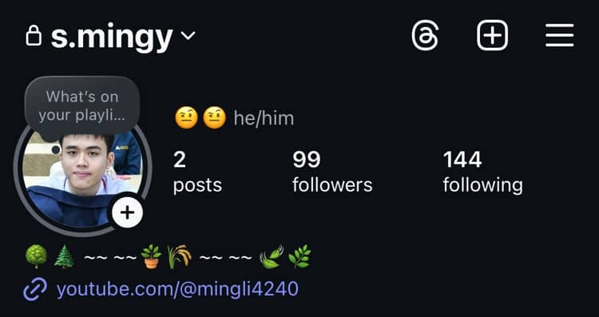

## ชื่อจริง : ญาราภรณ์ อิ่มอารมย์ :snowman:
=======
<b>ชื่อจริง :</b> มีบุญ หุนเจริญ 😸

<b>ชื่อเล่น :</b> หมิง

<b>รหัสนักศึกษา : </b> 68130500062

------------------------------------------------------------
<b>1.เคยร้องไห้เพราะความดีใจเรื่องอะไร </b>
ไปแข่ง English Public Speaking Contest ระดับปวช. ปวส. ระดับประเทศแล้วได้ที่ 1

<b>2.ด้านไหนของตัวเองที่คนอื่นไม่ค่อยรู้ </b>
ผมเป็นคนพูดไปเรื่อย แต่ถ้าอยู่กับคนที่ไม่สนิทจะเงียบกริบ

<b>3.อะไรคือความสุขของคุณ </b>
เล่นเกม (ต้องชนะ ก่อนชนะต้องมีการที่ฝ่ายศัตรูเกือบจบเกมเราได้แล้วพิมพ์ด่าเรา ก่อนที่มันจะพลาดแล้วเราพลิกกลับมาชนะแล้วพิมพ์ด่ามันกลับให้เจ็บไปจนกว่ามันจะสิ่นลมหายใจในชาติหน้า)

<b>4.ทำไมถึงเลือกมาเรียน it // เรียนมาแล้ว 3 สัปดาห์รู้เรื่องอะไรบ้าง </b>
เพราะชอบอยู่กับคอม และเรียนตรงสายมา เรียนมา 3 สัปดาห์รู้อยู่อย่างเดียวคืองานใหม่มาทุกวัน

<b>5.มองชีวิตในอีก 5 ปีข้างหน้าไว้ยังไง </b>
อาจจะมีงานทำแล้ว และหาความรู้ใหม่ๆ เพื่อพัฒนาตัวเองในงานที่ทำ

<b>6.จุดแข็งและจุดอ่อนของตัวเอง </b>
จุดแข็งคือ: ไม่ค่อยเครียดมากเท่าไหร่เวลากดดัน จุดอ่อนคือ: ไม่สามารถทำงานในระยะเวลาที่นานเกิน 1 ชม. เพราะจะหลับระหว่างหาคำตอบไม่ก็ไปเล่นเกม

<b>7.ความรักที่ดีคืออะไร ถ้ารักใครรักคนในวันที่เจอเขาวันสุดท้ายของชีวิตจะทำอะไรบ้างใน 1 วัน </b>
ความรักที่ดีคือการยอมรับได้ในสิ่งที่อีกฝ่ายเป็น และมีเหตุผลต่อกัน ถ้าต้องเจอเขาเป็นวันสุดท้ายของชีวิตจะพาไปเที่ยว กินข้าว คุยกันในเหตุการณ์และเรื่องราวที่สร้างขึ้นมาด้วยกัน

<b>8.ไม่ชอบคนนิสัยแบบไหน เพราะอะไร</b>
ไม่ชอบคนที่ไม่ตรงใจ แบบทำสิ่งที่ไม่ตรงกับใจเพื่อให้ตัวเองดูดีในสายตาคนอื่นเพื่อได้รับการยอมรับ แต่สุดท้ายก็ออกอาการที่เป็นนิสัยแย่ๆ ออกมาลับหลัง

<b>9.ถ้ามีโอกาสไปเที่ยวที่ไหนก็ได้ที่นึง จะไปที่ไหน เพราะอะไร</b>
อยากไป Switzerland เพราะมีธรรมชาติที่สวยงาม และบรรยากาศที่สดชื่น ทำให้ไเหมือนได้อยู่กับธรรมชาติ ทำให้จิตใจผ่อนคลาย

---------------------------------------------------------------------------------------------------------------

1 เพลงที่บ่งบอกความเป็นตัวคุณ <a href="url">[link text](https://youtu.be/-MdKKKkZc-E?si=VwSPr6vZq756UeOt)</a> 🎵:

Contact  <a href="url">[link text](https://www.instagram.com/s.mingy/)</a> 🔗:

สัมภาษณ์โดย  นางสาวจุฑาภรณ์ แซ่จ้อง ⭐:

----------------------------------------------------------------------------

### ชื่อจริง : เจษฎาพร จันทร์ประเสริฐ 🤵‍♂️
### ชื่อเล่น : กัน
### รหัสนักศึกษา : 68130500010
#### 1.เคยร้องไห้เพราะความดีใจเรื่องอะไร :
ตอนกินเหล้าแล้วเมาดีใจที่เพื่อนบอกรักทั้งๆที่เมา
#### 2.ด้านไหนของตัวเองที่คนอื่นไม่ค่อยรู้ :
ไม่ค่อยบอกตรงๆว่ารู้สึกอะไรอยู่
#### 3.อะไรคือความสุขของคุณ :
การที่สามารถทำอะไรหรืออยู่กับอะไรได้นานๆ
#### 4.ทำไมถึงเลือกมาเรียน it // เรียนมาแล้ว 3 สัปดาห์รู้เรื่องอะไรบ้าง :
เลือกมาเรียนไอทีเพราะมีความสนใจด้านคอมพิวเตอร์ แต่ไม่ชอบวิชาคณิต เลยพยายามหาคณะที่ใช้คณิตไม่ยาก เลยมาจบที่คณะไอที  
รู้ว่ามีอะไรที่ต้องเรียนรู้อีกมาก และควรจัดการ ให้ลำดับความสำคัญสิ่งต่างๆให้ดี ควรแบ่งเวลาไปทบทวนบทเรียนภายในเวลาหลังเรียนบ้าง เพราะรู้สึกว่าเรียนไปจะลืมๆ5555
#### 5.มองชีวิตในอีก 5 ปีข้างหน้าไว้ยังไง :
จะมีความรู้การลงทุน/การเงิน ถ้าทำงานก็คงทำงานที่ตลาดต้องการและตัวเองพึงพอใจ 
เรื่องความรักคงเรื่อยๆไม่ได้รีบร้อนอะไร 
เป้าหมายตอนนั้นคงเป็นหาเงินให้เยอะและหาความมั่นคงให้ชีวิต
#### 6.จุดแข็งและจุดอ่อนของตัวเอง :
จุดแข็ง: กล้าเสี่ยง,กล้าแสดงความคิดเห็น,แต่งตัวเก่ง,ไอเดียดี,มีเหตุผล,หัวแล่นคิดเร็ว,เจอสภาพแวดล้อมที่เหมาะสมจะทำงานได้เร็ว,ชอบตั้งคำถาม,มีความมั่นใจ(ไม่มั่นหน้า) 
จุดอ่อน: ยอมรับความเสี่ยง(ที่คาดไม่ถึง)ไม่ได้,คิดไปเรื่อย,ไม่รอบคอบ,อ่านใจคนไม่เก่ง,ไม่รู้ว่าตัวเองรู้สึกยังไง,ไม่มีระเบียบ
#### 7.ความรักที่ดีคืออะไร ถ้ารักใครรักคนในวันที่เจอเขาวันสุดท้ายของชีวิตจะทำอะไรบ้างใน 1 วัน :
ความรักที่ดีคือ รักแบบมีสติ รู้สึกอะไรก็พูดออกมาไม่เก็บไว้คนเดียว มีการสื่อสารที่ดี รู้สึกปลอดภัย
##### วันที่เจอเขาวันสุดท้ายของชีวิตจะทำอะไรบ้างใน 1 วัน :
เดินไปเรื่อยๆในที่ที่ไม่เคยไป พูดคุย กินอะไรอร่อย ๆ นั่งโง่ ๆ ไปเรื่อย ๆ ด้วยกันจนหมดลมหายใจ
#### 8.ไม่ชอบคนนิสัยแบบไหน เพราะอะไร :
ไม่ชอบคนขี้อวด/ชอบกดคนอื่นให้ต่ำกว่าตัวเอง เพราะ มันเป็นการดูถูกคนอื่น/ทำให้คนอื่นรู้สึกไม่ดี
#### 9.ถ้ามีโอกาสไปเที่ยวที่ไหนก็ได้ที่นึง จะไปที่ไหน เพราะอะไร :
อยากไปอิตาลี เพราะ สถาปัตยกรรมสวย สภาพอากาศดี บรรยากาศเหมาะสำหรับการไปเที่ยวแบบชิวๆ

#### 1เพลงบอกความเป็นตัวคุณ : <a href="url">[link text](https://youtu.be/fYD7YsSRHOY?si=Aaz116kvUk4yN5sB)</a> 🎵
#### Contact

### สัมภาษณ์โดย ญาราภรณ์ อิ่มอารมย์ 68130500015 

## ชื่อจริง : ญาราภรณ์ อิ่มอารมย์

## ชื่อเล่น : น้ำอิง
## รหัสนักศึกษา : 68130500015
#### 1.เคยร้องไห้เพราะความดีใจเรื่องอะไร : 
###### ตอนพยายามทำอะไรสักอย่างหนักมากๆแล้วประสบความสำเร็จ
#### 2.ด้านไหนของตัวเองที่คนอื่นไม่ค่อยรู้ :
###### เก็บทุกอย่างไว้ในใจ/เลือกคบคน ถ้ารู้สึกว่าไม่โอเคกับใครก็จะหายไปจากชีวิตคนนั้นแบบงียบๆ
#### 3.อะไรคือความสุขของคุณ : 
###### การที่เรารู้สึกสบายใจไม่มีอะไรหนักๆในใจ
#### 4.ทำไมถึงเลือกมาเรียน it // เรียนมาแล้ว 3 สัปดาห์รู้เรื่องอะไรบ้าง : 
###### มีความสนใจ/ความถนัดด้านไอทีอยู่บ้างเป็นทุนเดิม รู้สึกว่าสายงานในอนาคตยังคงต้องการอยู่เรื่อยๆ เป็นสิ่งที่ชอบกับคณะที่ใช่ // รู้ว่าควรจัดสรรเวลา/แบ่งเวลาให้ดีเพราะการบ้านมีเพิ่มมาทุกวัน ควรหมั่นทบทวน และควรใช้เวลาว่างในการศึกษาเพิ่มเติมนอกจากที่อาจารย์สอน จะเป็นประโยชน์แก่ตัวเองแน่นอน

#### 5.มองชีวิตในอีก 5 ปีข้างหน้าไว้ยังไง : 
###### หลังจากเรียนจบก็ใช้ชีวิตและทำงานอย่างเต็มที่ หาเงินมาให้พ่อแม่มีความสุขและสบาย ความรักขึ้นอยุ่กับว่าพร้อมมั้ยถ้าพร้อมก็มี มีเป้าหมายใหญ่กว่าเดิม
#### 6.จุดแข็งและจุดอ่อนของตัวเอง :
###### จุดแข็ง : เด็ดขาด เวลาตั้งใจมากจะทำจนกว่าจะสำเร็จ    จุดอ่อน : ไม่รอบคอบ ดูคนเก่ง เข้าสังคมไม่เก่ง 
#### 7.ความรักที่ดีคืออะไร ถ้ารักใครรักคนในวันที่เจอเขาวันสุดท้ายของชีวิตจะทำอะไรบ้างใน 1 วัน :
###### ปลอดภัยไม่ระแวง สบายใจกันทั้งคู่ อยู่ด้วยกันแล้วชีวิตดีขึ้น ไม่เกิดคำถามในความสัมพันธ์// อยู่กับเขาทั้งวันจนหมดลมหายใจ
#### 8.ไม่ชอบคนนิสัยแบบไหน เพราะอะไร :
###### โกหก เพราะว่า ไม่จริงใจ 
#### 9.ถ้ามีโอกาสไปเที่ยวที่ไหนก็ได้ที่นึง จะไปที่ไหน เพราะอะไร : 
###### ญี่ปุ่น เพราะว่า เมืองสวย มีแมวน่าเยอะ อาหารถูกปาก
#### เพลงที่บ่งบอกตัวคุณ : :new_moon:
###### <a href="https://www.youtube.com/watch?v=XjlSBN82hfo&list=RDXjlSBN82hfo&start_radio=1">link text</a>

## สัมภาษณ์โดย 68130500010 เจษฎาพร จันทร์ประเสริฐ :mute:
