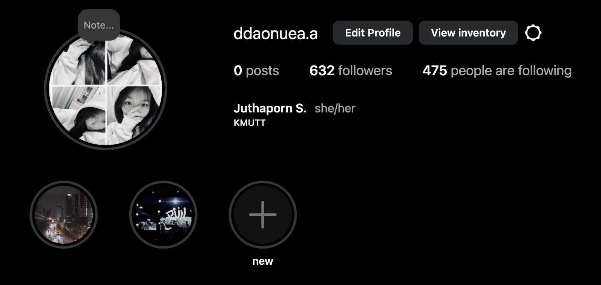
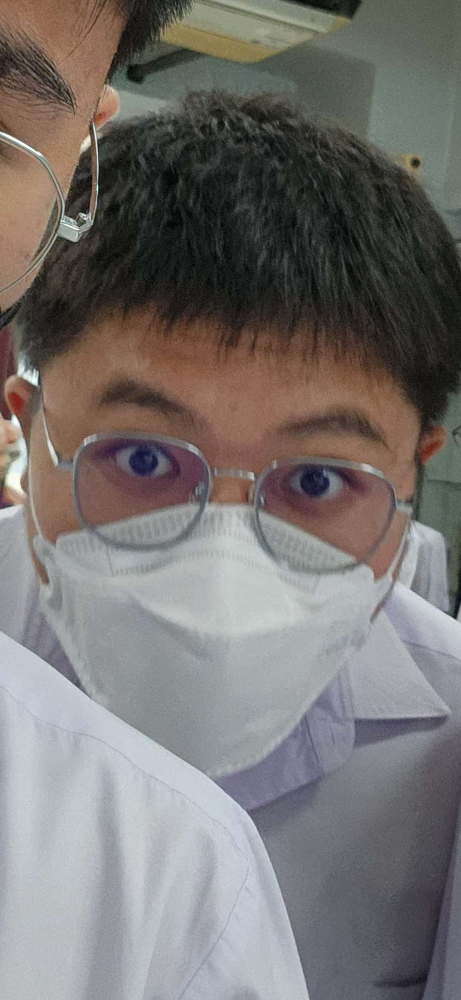
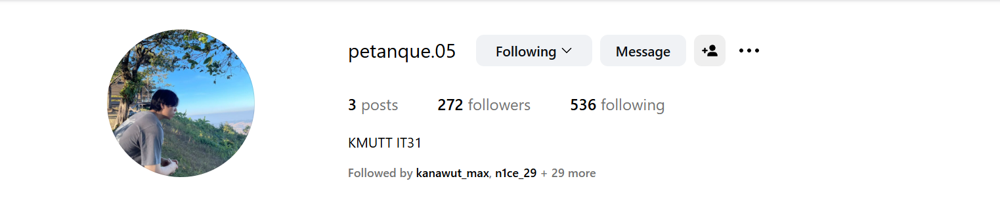

## ชื่อจริง : นางสาวจุฑาภรณ์ แซ่จ้อง

## ชื่อเล่น : ดาวเหนือ

## รหัสนักศึกษา : 68130500009

1.เคยร้องไห้เพราะความดีใจเรื่องอะไร : ทำของขวัญ Surprise วันแม่ด้วยตัวเองครั้งแรก

2.ด้านไหนของตัวเองที่คนอื่นไม่ค่อยรู้ : เป็นคนที่อ่อนไหวด้านความรู้สึกมากๆ หลายคนที่เห็นอาจจะเห็นว่าเป็นคนนิ่งแต่จริงๆ แล้วถ้ามีอะไรมาสะเทือนใจนิดหน่อยก็จะร้องไห้แล้ว

3.อะไรคือความสุขของคุณ : การโทรเล่าเรื่องราวที่เจอในแต่ละวันที่เจอให้แม่ฟังทุกคืน, สุนัขที่โตมาด้วยกันตั้งแต่เด็กๆ

4.ทำไมถึงเลือกมาเรียน it // เรียนมาแล้ว 3 สัปดาห์รู้เรื่องอะไรบ้าง : มีความชื่นชอบทางด้านเทคโนโลยีบวกกับความถนัดที่มี 
เรียนมา 3 สัปดาห์ได้เรียนรู้การเรียน python ตรรกศาสตร์ การทำธุรกิจ การออกแบบ และอื่นๆ อีกมากมาย

5.มองชีวิตในอีก 5 ปีข้างหน้าไว้ยังไง : มีงานที่มั่นคง ได้ทำในสิ่งที่ชอบมีความสุขกับชีวิต ได้ใช้ชีวิตในแบบของตัวเอง มีเงินสร้างบ้าน ซื้อรถ 
ทำตามความฝันของตัวเองถึงแม้อาจจะไม่เป็นไปตามที่หวังไว้ทั้งหมดแต่ขอให้ทุกอย่างที่ตัดสินใจเลือกเป็นสิ่งที่ดีที่สุด

6.จุดแข็งและจุดอ่อนของตัวเอง : จุดแข็ง ปรับตัวเข้ากับผู้อื่นได้ง่าย จุดอ่อน ไม่ค่อยชอบเข้าสังคม

7.ความรักที่ดีคืออะไร ถ้ารักใครรักคนในวันที่เจอเขาวันสุดท้ายของชีวิตจะทำอะไรบ้างใน 1 วัน : ความรักที่ดีคือความรักที่เต็มไปด้วยความรู้สึกที่ดี ทำให้เราเห็นคุณค่าของตัวเอง  
ไม่ทำให้ตัวเองรู้สึกไร้ค่า ได้รับมาโดยไม่ต้องร้องขอ ถ้าต้องเจอกันวันสุดท้ายคงอาจจะพาไปทำกิจกรรมทุกอย่างที่อยากทำกับเขาถ่ายรูปด้วยกันเยอะๆ  
ถึงแม้คนจะไม่อยู่แต่ก็ยังมีภาพมายืนยันเรื่องราวของเราได้

8.ไม่ชอบคนนิสัยแบบไหน เพราะอะไร : ไม่ชอบคนที่ไม่มีมารยาท เพราะเคยเจอเหตุการณ์ที่โดนที่รู้จักแต่ไม่สนิทพูดคำหยาบคายใส่ แต่เขามองว่าเป็นเรื่องปกติทั้งที่ไม่ควรที่จะทำ

9.ถ้ามีโอกาสไปเที่ยวที่ไหนก็ได้ที่นึง จะไปที่ไหน เพราะอะไร : ไปดูแสงเหนือที่ไหนสักแห่งบนโลก เพราะอยากเห็นความสวยงามของแสงเหนือด้วยตาของตัวเองจริงๆ สักครั้ง

### เพลงที่บ่งบอกตัวเอง :
<a href="https://youtu.be/PCDYbzbYP4w?si=0WY0OW_i2Sc77GtN">PUN - Perfect (feat. 1MILL)</a>

### สัมภาษณ์โดย 062 มีบุญ หุนเจริญ (หมิง) ☄️🌃  

## ชื่อจริง : ธีรภัทร์ ตั้งพิทักษ์สกุล 
## ชื่อเล่น : นะโม 
## รหัสนักศึกษา : 68130500033 
**1.เคยร้องไห้เพราะความดีใจเรื่องอะไร :** ตอนไปดู concert แล้ววงที่ชอบขึ้น เขาร้องเพราะมากๆ แล้วน้ำตาผมมันไหลไปเอง 

**2.ด้านไหนของตัวเองที่คนอื่นไม่ค่อยรู้ :** คิดว่าน่าจะเป็นเรื่องอารมณ์ เพราะปกติผมเป็นคนค่อนข้างอารมณ์ร้อนง่าย หงุดหงิดง่าย แต่ผมคุมตัวเองดีทำให้คนรอบข้างไม่ค่อยรู้ว่าผมโกรธรึป่าว 

**3.อะไรคือความสุขของคุณ :** การได้ลองทำอะไรใหม่ๆที่อยากทำ , ทำบางอย่างที่ทำอยู่สำเร็จ , ตีแบด , ได้ใช้เวลากับคนที่เราอยู่ด้วยละสบายใจ 

**4.ทำไมถึงเลือกมาเรียน it // เรียนมาแล้ว 3 สัปดาห์รู้เรื่องอะไรบ้าง :**  
ผมมาเรียน it เพราะว่าจากที่หาๆดูมาหลายๆ คณะผมรู้สึกชอบอันนี้มากที่สุดเฉยๆเลยเลือก  
เพราะเอาจริงๆผมไม่ได้อยากเรียนอะไรเป็นพิเศษ + กับผมเคยสนใจเรื่องการทำเกม การทำเว็ปอยู่ช่วงนึงด้วยเลยเลือกที่จะมาเรียน it , 
เรียนมาแล้ว 3 สัปดาห์ก็ได้รู้หลายๆเรื่องจากทั้งอาจารย์รวมถึงเพื่อนๆ และได้เข้าใจการเรียนแบบใหม่ๆ ที่ไม่เหมือนตอนมัธยม 

**5.มองชีวิตในอีก 5 ปีข้างหน้าไว้ยังไง :** ในอีก 5 ปีผมคิดว่าผมคงเริ่มทำงานแล้ว มองว่าผมน่าจะมีทักษะพอที่จะสามารถหาเงินได้ในระดับนึงเพื่อช่วยแม่ส่งน้องเรียนให้จบ 
กับหาเงินซื้อของต่างๆที่อยากได้ คิดว่าตอนนั้นผมน่าจะเริ่มศึกษาเรื่องการลงทุนต่างๆในระดับลึกๆ 

**6.จุดแข็งและจุดอ่อนของตัวเอง :** จุดแข็งคิดว่าตัวเองเป็นคนมีไฟง่ายและพอมีไฟผมมักทำมันอย่างสุดๆ ใช้เวลาเยอะมากๆกับสิ่งที่ผมสนใจ 
จุดอ่อน คิดว่าผมเป็นคนที่หมดไฟง่ายเหมือนกันเนื่องจากผมเป็นคนชอบทำอะไรที่เดียวยาวๆ ซึ่งพอมันเป็นยังงั้นผมมักจะเบื่อได้ไวละหมดไฟได้ง่าย 

**7.ความรักที่ดีคืออะไร ถ้ารักใครสักคน ในวันที่เจอเขาวันสุดท้ายของชีวิตจะทำอะไรบ้างใน 1 วัน :**  
ผมคิดว่ามันคือการเข้าใจกันและกันว่าเขารู้สึกอะไร รู้สึกยังไง และไม่ว่าในวันที่ดีที่สุด หรือวันที่แย่ที่สุดก็พร้อมที่จะช่วยเหลือกันอยู่เสมอ คอยเป็นกำลังใจให้กัน , 
ถ้าได้เจอคนที่ผมรักมากๆ ไม่ว่าจะเป็นใครก็ตาม แล้วผมรู้ว่านี่คือวันสุดท้ายของผมแล้วผมคงจะใช้ทุกเวลาที่เหลือกับเขาให้ได้มากที่สุด ทำให้ผมและเขามีความสุข และทำให้สิ่งที่เกิดขึ้นนั้นเป็น 1 ในความทรงจำที่ดีที่สุดของเขา 

**8.ไม่ชอบคนนิสัยแบบไหน เพราะอะไร :** ผมไม่ชอบคนที่มั่นใจตัวเองมากเกินไปยึดตัวเองเป็นศูนย์กลางทุกสิ่ง ไม่ฟังใคร เอาเปรียบคนอื่น 

**9.ถ้ามีโอกาสไปเที่ยวที่ไหนก็ได้ที่นึง จะไปที่ไหน เพราะอะไร :** lake tekapo, New Zealand ผมคิดว่ามันสวยมากๆ 
และอีกอย่างจากที่เห็นๆมาตอนกลางคืนมันสามารถมองเห็นดาวได้มากมายๆ ผมอยากมีฟิลนั่งอยู่กับเพื่อนๆสักกลุ่มเล่นดนตรีกันละดูดาวไปด้วยอะไรประมาณนี้ 
[insta](https://www.instagram.com/a.b.c.d.e.f.gnm)\
[song](https://youtu.be/zd1saghcb2o?si=_X_zn4LmqlrBX4Kt)\

😃
### สัมภาษณ์โดย เปตอง  

## ชื่อจริง : นิธิศ ถังทอง  
## ชื่อเล่น : เปตอง 
## รหัสนักศึกษา : 68130500038  

### 1.เคยร้องไห้เพราะความดีใจเรื่องอะไร : 🥹  
ดีใจอะไรสักอย่างตอนดูหนังแต่จำไม่ได้ว่าเรื่องอะไร 
### 2.ด้านไหนของตัวเองที่คนอื่นไม่ค่อยรู้ : 🥴 
เราชอบทำไรไปเรื่อย อยู่นิ่งไม่ได้ 
### 3.อะไรคือความสุขของคุณ : 🥰 
การฟังเพลง,เสียงดนตรี 
### 4.ทำไมถึงเลือกมาเรียน it // เรียนมาแล้ว 3 สัปดาห์รู้เรื่องอะไรบ้าง : 🤔 
ไม่รู้จะเรียนอะไรดีเลยเลือก it//ยังไม่รู้อะไรเลย 
### 5.มองชีวิตในอีก 5 ปีข้างหน้าไว้ยังไง : 😶‍🌫️ 
เรียนจบ 
### 6.จุดแข็งและจุดอ่อนของตัวเอง : 🤨 
จุดแข็ง พร้อมที่จะเรียนรู้สิ่งใหม่ๆ,จุดอ่อน ถ้าไม่ใช่สิ่งที่สนใจจะไม่เอาอะไรเลย 
### 7.ความรักที่ดีคืออะไร ถ้ารักใครรักคนในวันที่เจอเขาวันสุดท้ายของชีวิตจะทำอะไรบ้างใน 1 วัน : ❤️ 
รักที่เขาเป็นตัวของเขาเองไม่ใช่เพราะอย่างอื่น,บอกสิ่งที่อยากบอกทั้งหมดและทำสิ่งที่อยากทำทั้งหมด 
### 8.ไม่ชอบคนนิสัยแบบไหน เพราะอะไร : 🫥 
คนที่ชอบพูดลับหลัง เพราะรู้สึกว่ามันไม่แฟร์ 
### 9.ถ้ามีโอกาสไปเที่ยวที่ไหนก็ได้ที่นึง จะไปที่ไหน เพราะอะไร : 🛫 
ประเทศใดก็ได้ที่มีคอนOasis เพราะอยากดูซักครั้งในชีวิต 
### 1 เพลงที่บ่งบอกความเป็นตัวคุณ : <a href="url">[link text](https://youtu.be/9YU94V1q4c8?si=O_Mugitf3U4aRcYe)</a> 🎵: 
### Contact <a href="url">[link text](https://www.instagram.com/petanque.05?igsh=MTkyZW01Z3V3eTJkOA%3D%3D&utm_source=qr)</a> 🔗: 
 

### สัมภาษณ์โดย 68130500033-นะโม (🙏)

## ชื่อจริง : มีบุญ หุนเจริญ 😸 

## ชื่อเล่น : หมิง 

## รหัสนักศึกษา : 68130500062  

------------------------------------------------------------
<b>1.เคยร้องไห้เพราะความดีใจเรื่องอะไร </b>
ไปแข่ง English Public Speaking Contest ระดับปวช. ปวส. ระดับประเทศแล้วได้ที่ 1

<b>2.ด้านไหนของตัวเองที่คนอื่นไม่ค่อยรู้ </b>
ผมเป็นคนพูดไปเรื่อย แต่ถ้าอยู่กับคนที่ไม่สนิทจะเงียบกริบ

<b>3.อะไรคือความสุขของคุณ </b>
เล่นเกม (ต้องชนะ ก่อนชนะต้องมีการที่ฝ่ายศัตรูเกือบจบเกมเราได้แล้วพิมพ์ด่าเรา ก่อนที่มันจะพลาดแล้วเราพลิกกลับมาชนะแล้วพิมพ์ด่ามันกลับให้เจ็บไปจนกว่ามันจะสิ่นลมหายใจในชาติหน้า)

<b>4.ทำไมถึงเลือกมาเรียน it // เรียนมาแล้ว 3 สัปดาห์รู้เรื่องอะไรบ้าง </b>
เพราะชอบอยู่กับคอม และเรียนตรงสายมา เรียนมา 3 สัปดาห์รู้อยู่อย่างเดียวคืองานใหม่มาทุกวัน

<b>5.มองชีวิตในอีก 5 ปีข้างหน้าไว้ยังไง </b>
อาจจะมีงานทำแล้ว และหาความรู้ใหม่ๆ เพื่อพัฒนาตัวเองในงานที่ทำ

<b>6.จุดแข็งและจุดอ่อนของตัวเอง </b>
จุดแข็งคือ: ไม่ค่อยเครียดมากเท่าไหร่เวลากดดัน จุดอ่อนคือ: ไม่สามารถทำงานในระยะเวลาที่นานเกิน 1 ชม. เพราะจะหลับระหว่างหาคำตอบไม่ก็ไปเล่นเกม

<b>7.ความรักที่ดีคืออะไร ถ้ารักใครรักคนในวันที่เจอเขาวันสุดท้ายของชีวิตจะทำอะไรบ้างใน 1 วัน </b>
ความรักที่ดีคือการยอมรับได้ในสิ่งที่อีกฝ่ายเป็น และมีเหตุผลต่อกัน ถ้าต้องเจอเขาเป็นวันสุดท้ายของชีวิตจะพาไปเที่ยว กินข้าว คุยกันในเหตุการณ์และเรื่องราวที่สร้างขึ้นมาด้วยกัน

<b>8.ไม่ชอบคนนิสัยแบบไหน เพราะอะไร</b>
ไม่ชอบคนที่ไม่ตรงใจ แบบทำสิ่งที่ไม่ตรงกับใจเพื่อให้ตัวเองดูดีในสายตาคนอื่นเพื่อได้รับการยอมรับ แต่สุดท้ายก็ออกอาการที่เป็นนิสัยแย่ๆ ออกมาลับหลัง

<b>9.ถ้ามีโอกาสไปเที่ยวที่ไหนก็ได้ที่นึง จะไปที่ไหน เพราะอะไร</b>
อยากไป Switzerland เพราะมีธรรมชาติที่สวยงาม และบรรยากาศที่สดชื่น ทำให้ไเหมือนได้อยู่กับธรรมชาติ ทำให้จิตใจผ่อนคลาย

---------------------------------------------------------------------------------------------------------------

1 เพลงที่บ่งบอกความเป็นตัวคุณ <a href="url">[link text](https://youtu.be/-MdKKKkZc-E?si=VwSPr6vZq756UeOt)</a> 🎵:

Contact  <a href="url">[link text](https://www.instagram.com/s.mingy/)</a> 🔗:

### สัมภาษณ์โดย  นางสาวจุฑาภรณ์ แซ่จ้อง ⭐:

----------------------------------------------------------------------------

### ชื่อจริง : เจษฎาพร จันทร์ประเสริฐ 🤵‍♂️
### ชื่อเล่น : กัน
### รหัสนักศึกษา : 68130500010
#### 1.เคยร้องไห้เพราะความดีใจเรื่องอะไร :
ตอนกินเหล้าแล้วเมาดีใจที่เพื่อนบอกรักทั้งๆที่เมา
#### 2.ด้านไหนของตัวเองที่คนอื่นไม่ค่อยรู้ :
ไม่ค่อยบอกตรงๆว่ารู้สึกอะไรอยู่
#### 3.อะไรคือความสุขของคุณ :
การที่สามารถทำอะไรหรืออยู่กับอะไรได้นานๆ
#### 4.ทำไมถึงเลือกมาเรียน it // เรียนมาแล้ว 3 สัปดาห์รู้เรื่องอะไรบ้าง :
เลือกมาเรียนไอทีเพราะมีความสนใจด้านคอมพิวเตอร์ แต่ไม่ชอบวิชาคณิต เลยพยายามหาคณะที่ใช้คณิตไม่ยาก เลยมาจบที่คณะไอที  
รู้ว่ามีอะไรที่ต้องเรียนรู้อีกมาก และควรจัดการ ให้ลำดับความสำคัญสิ่งต่างๆให้ดี ควรแบ่งเวลาไปทบทวนบทเรียนภายในเวลาหลังเรียนบ้าง เพราะรู้สึกว่าเรียนไปจะลืมๆ5555
#### 5.มองชีวิตในอีก 5 ปีข้างหน้าไว้ยังไง :
จะมีความรู้การลงทุน/การเงิน ถ้าทำงานก็คงทำงานที่ตลาดต้องการและตัวเองพึงพอใจ 
เรื่องความรักคงเรื่อยๆไม่ได้รีบร้อนอะไร 
เป้าหมายตอนนั้นคงเป็นหาเงินให้เยอะและหาความมั่นคงให้ชีวิต
#### 6.จุดแข็งและจุดอ่อนของตัวเอง :
จุดแข็ง: กล้าเสี่ยง,กล้าแสดงความคิดเห็น,แต่งตัวเก่ง,ไอเดียดี,มีเหตุผล,หัวแล่นคิดเร็ว,เจอสภาพแวดล้อมที่เหมาะสมจะทำงานได้เร็ว,ชอบตั้งคำถาม,มีความมั่นใจ(ไม่มั่นหน้า) 
จุดอ่อน: ยอมรับความเสี่ยง(ที่คาดไม่ถึง)ไม่ได้,คิดไปเรื่อย,ไม่รอบคอบ,อ่านใจคนไม่เก่ง,ไม่รู้ว่าตัวเองรู้สึกยังไง,ไม่มีระเบียบ
#### 7.ความรักที่ดีคืออะไร ถ้ารักใครรักคนในวันที่เจอเขาวันสุดท้ายของชีวิตจะทำอะไรบ้างใน 1 วัน :
ความรักที่ดีคือ รักแบบมีสติ รู้สึกอะไรก็พูดออกมาไม่เก็บไว้คนเดียว มีการสื่อสารที่ดี รู้สึกปลอดภัย
##### วันที่เจอเขาวันสุดท้ายของชีวิตจะทำอะไรบ้างใน 1 วัน :
เดินไปเรื่อยๆในที่ที่ไม่เคยไป พูดคุย กินอะไรอร่อย ๆ นั่งโง่ ๆ ไปเรื่อย ๆ ด้วยกันจนหมดลมหายใจ
#### 8.ไม่ชอบคนนิสัยแบบไหน เพราะอะไร :
ไม่ชอบคนขี้อวด/ชอบกดคนอื่นให้ต่ำกว่าตัวเอง เพราะ มันเป็นการดูถูกคนอื่น/ทำให้คนอื่นรู้สึกไม่ดี
#### 9.ถ้ามีโอกาสไปเที่ยวที่ไหนก็ได้ที่นึง จะไปที่ไหน เพราะอะไร :
อยากไปอิตาลี เพราะ สถาปัตยกรรมสวย สภาพอากาศดี บรรยากาศเหมาะสำหรับการไปเที่ยวแบบชิวๆ

#### 1เพลงบอกความเป็นตัวคุณ : <a href="url">[link text](https://youtu.be/fYD7YsSRHOY?si=Aaz116kvUk4yN5sB)</a> 🎵
#### Contact

### สัมภาษณ์โดย ญาราภรณ์ อิ่มอารมย์ 68130500015 

## ชื่อจริง : ญาราภรณ์ อิ่มอารมย์

## ชื่อเล่น : น้ำอิง
## รหัสนักศึกษา : 68130500015
#### 1.เคยร้องไห้เพราะความดีใจเรื่องอะไร : 
###### ตอนพยายามทำอะไรสักอย่างหนักมากๆแล้วประสบความสำเร็จ
#### 2.ด้านไหนของตัวเองที่คนอื่นไม่ค่อยรู้ :
###### เก็บทุกอย่างไว้ในใจ/เลือกคบคน ถ้ารู้สึกว่าไม่โอเคกับใครก็จะหายไปจากชีวิตคนนั้นแบบงียบๆ
#### 3.อะไรคือความสุขของคุณ : 
###### การที่เรารู้สึกสบายใจไม่มีอะไรหนักๆในใจ
#### 4.ทำไมถึงเลือกมาเรียน it // เรียนมาแล้ว 3 สัปดาห์รู้เรื่องอะไรบ้าง : 
###### มีความสนใจ/ความถนัดด้านไอทีอยู่บ้างเป็นทุนเดิม รู้สึกว่าสายงานในอนาคตยังคงต้องการอยู่เรื่อยๆ เป็นสิ่งที่ชอบกับคณะที่ใช่ // รู้ว่าควรจัดสรรเวลา/แบ่งเวลาให้ดีเพราะการบ้านมีเพิ่มมาทุกวัน ควรหมั่นทบทวน และควรใช้เวลาว่างในการศึกษาเพิ่มเติมนอกจากที่อาจารย์สอน จะเป็นประโยชน์แก่ตัวเองแน่นอน

#### 5.มองชีวิตในอีก 5 ปีข้างหน้าไว้ยังไง : :computer:
###### หลังจากเรียนจบก็ใช้ชีวิตและทำงานอย่างเต็มที่ หาเงินมาให้พ่อแม่มีความสุขและสบาย ความรักขึ้นอยุ่กับว่าพร้อมมั้ยถ้าพร้อมก็มี มีเป้าหมายใหญ่กว่าเดิม
#### 6.จุดแข็งและจุดอ่อนของตัวเอง :
###### จุดแข็ง : เด็ดขาด เวลาตั้งใจมากจะทำจนกว่าจะสำเร็จ    จุดอ่อน : ไม่รอบคอบ ดูคนเก่ง เข้าสังคมไม่เก่ง 
#### 7.ความรักที่ดีคืออะไร ถ้ารักใครรักคนในวันที่เจอเขาวันสุดท้ายของชีวิตจะทำอะไรบ้างใน 1 วัน :
###### ปลอดภัยไม่ระแวง สบายใจกันทั้งคู่ อยู่ด้วยกันแล้วชีวิตดีขึ้น ไม่เกิดคำถามในความสัมพันธ์// อยู่กับเขาทั้งวันจนหมดลมหายใจ
#### 8.ไม่ชอบคนนิสัยแบบไหน เพราะอะไร :
###### โกหก เพราะว่า ไม่จริงใจ 
#### 9.ถ้ามีโอกาสไปเที่ยวที่ไหนก็ได้ที่นึง จะไปที่ไหน เพราะอะไร : 
###### ญี่ปุ่น เพราะว่า เมืองสวย มีแมวน่าเยอะ อาหารถูกปาก
#### เพลงที่บ่งบอกตัวคุณ : :new_moon:
###### <a href="https://www.youtube.com/watch?v=XjlSBN82hfo&list=RDXjlSBN82hfo&start_radio=1">link text</a>

## สัมภาษณ์โดย 68130500010 เจษฎาพร จันทร์ประเสริฐ :mute:
