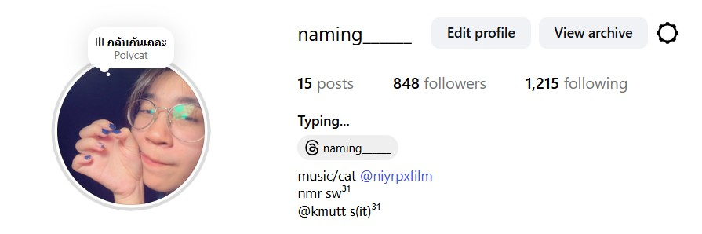

## ชื่อจริง : ญาราภรณ์ อิ่มอารมย์
## ชื่อเล่น : น้ำอิง
## รหัสนักศึกษา : 68130500015
#### 1.เคยร้องไห้เพราะความดีใจเรื่องอะไร : 
###### ตอนพยายามทำอะไรสักอย่างหนักมากๆแล้วประสบความสำเร็จ
#### 2.ด้านไหนของตัวเองที่คนอื่นไม่ค่อยรู้ :
###### เก็บทุกอย่างไว้ในใจ/เลือกคบคน ถ้ารู้สึกว่าไม่โอเคกับใครก็จะหายไปจากชีวิตคนนั้นแบบงียบๆ
#### 3.อะไรคือความสุขของคุณ : 
###### การที่เรารู้สึกสบายใจไม่มีอะไรหนักๆในใจ
#### 4.ทำไมถึงเลือกมาเรียน it // เรียนมาแล้ว 3 สัปดาห์รู้เรื่องอะไรบ้าง : 
###### มีความสนใจ/ความถนัดด้านไอทีอยู่บ้างเป็นทุนเดิม รู้สึกว่าสายงานในอนาคตยังคงต้องการอยู่เรื่อยๆ เป็นสิ่งที่ชอบกับคณะที่ใช่ // รู้ว่าควรจัดสรรเวลา/แบ่งเวลาให้ดีเพราะการบ้านมีเพิ่มมาทุกวัน ควรหมั่นทบทวน และควรใช้เวลาว่างในการศึกษาเพิ่มเติมนอกจากที่อาจารย์สอน จะเป็นประโยชน์แก่ตัวเองแน่นอน

#### 5.มองชีวิตในอีก 5 ปีข้างหน้าไว้ยังไง : 
###### หลังจากเรียนจบก็ใช้ชีวิตและทำงานอย่างเต็มที่ หาเงินมาให้พ่อแม่มีความสุขและสบาย ความรักขึ้นอยุ่กับว่าพร้อมมั้ยถ้าพร้อมก็มี มีเป้าหมายใหญ่กว่าเดิม
#### 6.จุดแข็งและจุดอ่อนของตัวเอง :
###### จุดแข็ง : เด็ดขาด เวลาตั้งใจมากจะทำจนกว่าจะสำเร็จ    จุดอ่อน : ไม่รอบคอบ ดูคนเก่ง เข้าสังคมไม่เก่ง 
#### 7.ความรักที่ดีคืออะไร ถ้ารักใครรักคนในวันที่เจอเขาวันสุดท้ายของชีวิตจะทำอะไรบ้างใน 1 วัน :
###### ปลอดภัยไม่ระแวง สบายใจกันทั้งคู่ อยู่ด้วยกันแล้วชีวิตดีขึ้น ไม่เกิดคำถามในความสัมพันธ์// อยู่กับเขาทั้งวันจนหมดลมหายใจ
#### 8.ไม่ชอบคนนิสัยแบบไหน เพราะอะไร :
###### โกหก เพราะว่า ไม่จริงใจ 
#### 9.ถ้ามีโอกาสไปเที่ยวที่ไหนก็ได้ที่นึง จะไปที่ไหน เพราะอะไร : 
###### ญี่ปุ่น เพราะว่า เมืองสวย มีแมวน่าเยอะ อาหารถูกปาก
#### เพลงที่บ่งบอกตัวคุณ : 
###### <a href="https://www.youtube.com/watch?v=XjlSBN82hfo&list=RDXjlSBN82hfo&start_radio=1">link text</a>

## สัมภาษณ์โดย 68130500010 เจษฎาพร จันทร์ประเสริฐ
